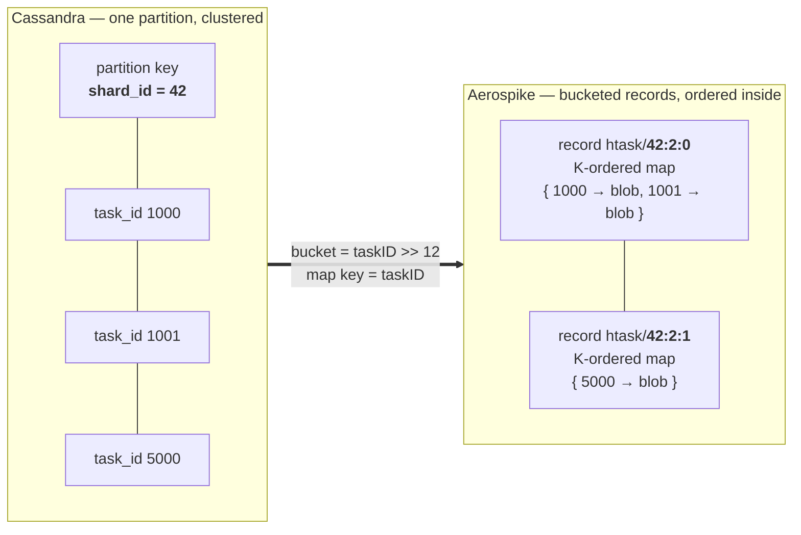
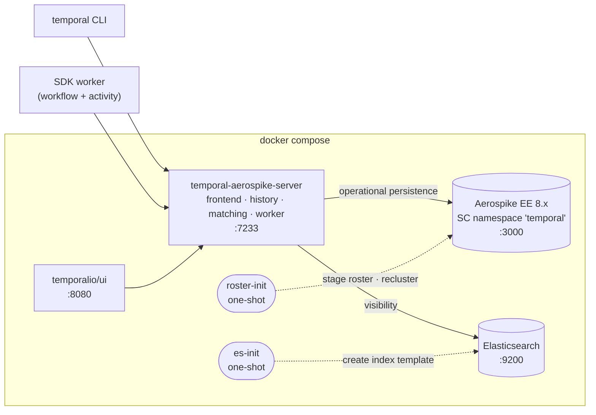

****# temporal-meets-aerospike

A proof of concept using **Aerospike** as the operational persistence store for
**Temporal Server**. Visibility stays on Elasticsearch — only the operational store is replaced.

Temporal ships Cassandra, MySQL and PostgreSQL stores. Aerospike has never been attempted; the
only prior art is a [2021 forum thread](https://community.temporal.io/t/aerospike-as-persistence-layer/1829)
where a maintainer said there were no obvious obstacles and invited a community contribution.

## Why this is interesting

Cassandra gives Temporal a partition key it chooses (`shard_id`), clustering-key range scans, and
single-partition conditional batches. Aerospike has none of those — it shards itself, and a record
is the unit of placement. What it does have is multi-record transactions and ordered collection
types. The project is really about whether one can be mapped onto the other.



## Architecture



The store is a **standalone Go module**. Temporal supports out-of-tree datastores through
`temporal.WithCustomDataStoreFactory()`, so no fork of Temporal is required.

## Status

| Iteration | Goal | State |
|---|---|---|
| 1 | Get it working — conformance suites green, workflow runs end to end | **complete** |
| 2 | Temporal's functional suite + performance tests green | not started |
| 3 | Optimization and tuning | not started |

### Iteration 1 phases

- [x] **Phase 0** — scaffolding, docker-compose stack, research notes
- [x] **Phase 1** — factory skeleton; shard, metadata, cluster-metadata stores
- [x] **Phase 2** — execution store: mutable state and current execution
- [x] **Phase 3** — history tasks on bucketed k-ordered maps
- [x] **Phase 4** — history event store *(pulled forward: the mutable-state suite depends on it)*
- [x] **Phase 5** — task store, queues, nexus, end-to-end workflow demo

## Results

Temporal's own persistence conformance suites, run against a live Aerospike node:

| Suite | Tests |
|---|---|
| `ShardSuite` | 4 |
| `ExecutionMutableStateSuite` | 45 |
| `ExecutionMutableStateTaskSuite` | 15 |
| `HistoryEventsSuite` | 12 |
| `TaskQueueSuite` / `TaskQueueTaskSuite` / `TaskQueueFairTaskSuite` / `TaskQueueUserDataSuite` | 18 |
| `QueueV2` + `HistoryTaskQueueManager` | 33 |
| `NexusEndpoint` | 9 |
| `MetadataPersistenceSuiteV2` | 22 |
| `HistoryV2PersistenceSuite` | 5 |
| `ClusterMetadataManagerSuite` | 7 |
| Aerospike capability checks (ours) | 6 |
| **Total** | **175 passing, 0 failing** |

And the thing that actually matters — a workflow with an activity, start to finish:

```
$ temporal operator cluster describe
  ClusterName  PersistenceStore  VisibilityStore
  active       aerospike         elasticsearch

$ go test ./e2e/ -v
    workflow started: id=85503329-3053-46ed-9bf2-bacbe4889498
    workflow completed: Hello world, from Aerospike
--- PASS: TestWorkflowWithActivity
```

## Documentation

| Doc | What it covers |
|---|---|
| [01 — Temporal persistence](docs/01-temporal-persistence.md) | The seam, the interface inventory, the atomicity and range-scan requirements |
| [02 — Aerospike capabilities](docs/02-aerospike-capabilities.md) | Strong consistency, MRT, CDT ordering, limits, licensing |
| [03 — Data model](docs/03-data-model.md) | The mapping, diagram-first. The living document |
| [04 — Open questions](docs/04-open-questions.md) | What is still unknown, and the experiment that settles each |
| [05 — Iterations 2 and 3](docs/05-iteration-2-3-sketch.md) | Direction for later work |

## Running it

Requires Docker. Aerospike Enterprise is used for its bundled **single-node evaluation feature
key** — strong consistency, multi-record transactions and durable deletes are all Enterprise-only.

```sh
# Infrastructure only (works from Phase 0 onward)
docker compose -f deploy/docker-compose.yml up -d aerospike roster-init elasticsearch es-init

# Full stack (needs the server binary, from Phase 1 onward)
docker compose -f deploy/docker-compose.yml up -d

# Capability tests -- assert the Aerospike behaviours the data model depends on
# (strong consistency, MRT commit/abort, generation CAS, CDT key ordering)
go test ./store/aerospike/ -v

# Conformance suites against the local Aerospike node (from Phase 1 onward)
go test ./conformance/...
```

> **Apple Silicon:** if `DOCKER_DEFAULT_PLATFORM=linux/amd64` is set in your shell, you will get an
> x86_64 Aerospike under qemu without any warning (~20x slower on tool startup). See
> [`deploy/.env.example`](deploy/.env.example).

An Aerospike strong-consistency namespace serves **nothing** until its roster is staged and the
cluster reclustered — that is what `roster-init` does, and why the server waits on it.

## Licensing caveat

Strong consistency, multi-record transactions and durable deletes are Enterprise-only features. The
Enterprise container image ships a perpetual single-node evaluation key, governed by the
[Aerospike Evaluation License](https://aerospike.com/legal/evaluation-license-agreement/):
evaluation and development only, **not for production use**.

This makes the PoC free and legal, and it bounds the conclusion — an Aerospike-backed Temporal
would only be usable by Aerospike Enterprise customers.
