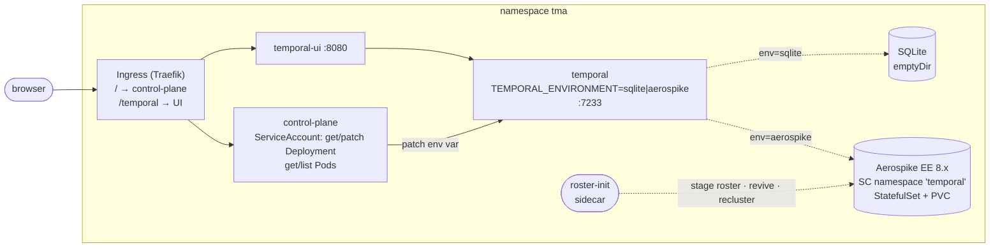

# k3s deployment

A single-node k3s deployment of the demo: Temporal Server whose **operational
persistence can be switched between SQLite and Aerospike at runtime**, with a
small web control plane that does the switching.

The reference stack is [`deploy/docker-compose.yml`](../docker-compose.yml).
This reproduces it with two deliberate differences:

| | compose | k3s |
|---|---|---|
| Visibility | Elasticsearch | SQLite |
| Backend switch | not possible | `TEMPORAL_ENVIRONMENT` on the Deployment |

Elasticsearch is out of scope: it is a second stateful service with a JVM heap
on a ~4 GB box, and the demo is about the *operational* store.



## Why k3s and not Docker

The control plane is a web service that restarts a workload. On Docker that
means bind-mounting `/var/run/docker.sock`, which is root on the host for
anyone who gets past the basic auth. On Kubernetes it is a namespaced Role with
three verbs on two resource types — see
[`40-control-plane-rbac.yaml`](40-control-plane-rbac.yaml). That trade is the
reason this directory exists.

---

## 1. Install k3s

On a fresh amd64 Linux VM, ~4 GB RAM:

```sh
curl -sfL https://get.k3s.io | sh -

# So kubectl works as your user rather than through `sudo k3s kubectl`.
mkdir -p ~/.kube
sudo cp /etc/rancher/k3s/k3s.yaml ~/.kube/config
sudo chown "$(id -u):$(id -g)" ~/.kube/config
kubectl get nodes
```

k3s brings its own Traefik ingress controller and a `local-path` default
StorageClass. Nothing else needs installing.

## 2. Build and import the two images

Both images are built from source in this repo and are **never pushed to a
registry**, so every manifest sets `imagePullPolicy: IfNotPresent`.

Build on the demo box if you can — then the architecture matches by
construction:

```sh
# from the repo root
docker build -f deploy/Dockerfile               -t temporal-meets-aerospike/server:dev        .
docker build -f deploy/Dockerfile.control-plane -t temporal-meets-aerospike/control-plane:dev .

# containerd, not dockerd, runs the pods -- the image has to be handed over
sudo docker save temporal-meets-aerospike/server:dev        | sudo k3s ctr images import -
sudo docker save temporal-meets-aerospike/control-plane:dev | sudo k3s ctr images import -

sudo k3s ctr images ls | grep temporal-meets-aerospike
```

Building on an **arm64 Mac** for an amd64 box: an arm64 image imports happily
and then fails with `exec format error`, which does not look like an
architecture problem. Cross-build explicitly and copy the tarball over:

```sh
docker buildx build --platform linux/amd64 -f deploy/Dockerfile \
  -t temporal-meets-aerospike/server:dev --output type=docker,dest=server.tar .
scp server.tar demo-box:
ssh demo-box 'sudo k3s ctr images import server.tar'
```

The third-party images (Aerospike, aerospike-tools, temporalio/ui) are pulled
normally and are multi-arch. Nothing here pins a platform — the node decides.

## 3. Apply the manifests

Filenames are numbered and `kubectl apply -f <dir>` processes them in
lexical order, so the Namespace exists before anything lands in it:

```sh
kubectl apply -f deploy/k8s/
kubectl -n tma get pods -w
```

Expected steady state — note `2/2` on Aerospike, which is the server plus the
roster sidecar:

```
NAME                             READY   STATUS    RESTARTS   AGE
aerospike-0                      2/2     Running   0          90s
control-plane-6d4f8b7c9d-hq2vn   1/1     Running   0          85s
temporal-7c9d5f8b6-2xk4m         1/1     Running   0          85s
temporal-ui-5f7b8c9d4-pl9wq      1/1     Running   0          85s
```

Aerospike takes 30–60 s to reach `2/2`: its readiness probe refuses until the
strong-consistency namespace is in a staged roster (`ns_cluster_size=1`) with
no unavailable or dead partitions, which cannot happen until the roster sidecar
has run.

Set a real password before exposing the box to anything:

```sh
kubectl -n tma create secret generic control-plane-auth \
  --from-literal=username=admin \
  --from-literal=password="$(openssl rand -base64 24)" \
  --dry-run=client -o yaml | kubectl apply -f -
kubectl -n tma rollout restart deployment/control-plane
```

## 4. Open it

There is no `host` rule on the Ingress, so any name that reaches the box works:

```sh
kubectl -n tma get ingress demo
hostname -I | awk '{print $1}'     # on the box
```

- `http://<ip>/` — control plane
- `http://<ip>/temporal` — Temporal Web UI

TLS is off. [`50-ingress.yaml`](50-ingress.yaml) has a commented cert-manager
block with the steps to turn it on once the box has a public DNS name.

## 5. Switch the backend

That is what the control plane's UI does, and it does it with this:

```sh
kubectl -n tma set env deployment/temporal TEMPORAL_ENVIRONMENT=aerospike
kubectl -n tma rollout status deployment/temporal
```

`sqlite` switches back. Both config files live in the same ConfigMap
([`20-temporal-config.yaml`](20-temporal-config.yaml)) and are mounted at
`/etc/temporal/config`; the binary passes `TEMPORAL_ENVIRONMENT` to Temporal's
config loader as `--env`, which loads `<value>.yaml`. Changing an env var
changes the pod template, so Kubernetes performs the restart — no ConfigMap
surgery, no `kubectl delete pod`.

The rollout strategy is `Recreate`, so the old server is gone before the new one
starts. Expect a few seconds of downtime per switch.

> **The two stores do not share data.** Workflows started on SQLite are not
> visible after switching to Aerospike, and the SQLite side is an `emptyDir`
> that is wiped on every restart. That is the demo, not a bug.

---

## Troubleshooting

### Which backend is live?

Three ways, cheapest first:

```sh
# what the Deployment is configured for
kubectl -n tma set env deployment/temporal --list | grep TEMPORAL_ENVIRONMENT

# what the running pod was actually started with -- differs from the above
# during a rollout, which is exactly when you care
kubectl -n tma get pods -l app.kubernetes.io/name=temporal \
  -o jsonpath='{range .items[*]}{.metadata.name}{"\t"}{.spec.containers[0].env[?(@.name=="TEMPORAL_ENVIRONMENT")].value}{"\t"}{.status.phase}{"\n"}{end}'

# what Temporal itself thinks -- the only answer that involves the store
kubectl -n tma run tctl --rm -it --restart=Never \
  --image=temporalio/admin-tools:1.31.2 -- \
  temporal operator cluster describe --address temporal:7233
```

The last one prints `PersistenceStore`, which reads `aerospike` or `sqlite`.

### Aerospike shows dead partitions

Symptom: `aerospike-0` sits at `1/2`, and Temporal crashloops with
`Node not found for partition temporal:4092` or times out on every read.

Confirm:

```sh
kubectl -n tma exec aerospike-0 -c aerospike -- \
  asinfo -v 'namespace/temporal' | tr ';' '\n' \
  | grep -E 'dead_partitions|unavailable_partitions|ns_cluster_size|strong-consistency'

kubectl -n tma exec aerospike-0 -c aerospike -- asinfo -v 'roster:namespace=temporal'
```

`ns_cluster_size=0` and `roster=null` mean the roster was never staged — the
partition counters read 0/0 in that state and are not evidence of health. That
is also why the readiness probe checks all three.

Dead partitions after a restart are **normal and expected**, and the sidecar
repairs them automatically — a strong-consistency namespace refuses to serve
data it cannot prove is complete, so any unclean stop (SIGKILL after the grace
period, node reboot, OOM kill) brings all 4096 back dead. If the sidecar ran,
they are already fixed by the time you look.

What `node-id` (pinned in the ConfigMap) prevents is the *other* failure: a
roster naming a node id that no longer exists, which is unrecoverable without
manual intervention and surfaces as `Node not found for partition
temporal:4092`. See `docs/04-open-questions.md` R16. If you see dead partitions
that the sidecar cannot clear, check that the ConfigMap still pins `node-id`.

Kick the sidecar:

```sh
kubectl -n tma logs aerospike-0 -c roster-init
kubectl -n tma delete pod aerospike-0        # sidecar re-runs on the new pod
```

To repair in place, by hand — this is what the sidecar does:

```sh
kubectl -n tma exec aerospike-0 -c roster-init -- bash -c '
  obs=$(asinfo -h 127.0.0.1 -v "roster:namespace=temporal" \
          | tr ":" "\n" | grep "^observed_nodes=" | cut -d= -f2)
  asinfo -h 127.0.0.1 -v "roster-set:namespace=temporal;nodes=$obs"
  asinfo -h 127.0.0.1 -v "revive:namespace=temporal"
  asinfo -h 127.0.0.1 -v "recluster:"
'
```

Use `asinfo`, never `asadm manage`: `manage` prompts for confirmation when the
namespace looks damaged and dies with `EOFError` without a TTY — which is
exactly when you need it. Note also that `roster:` separates fields with `:`
while `namespace/<ns>` uses `;`; parsing one with the other's separator
silently yields nothing.

`revive` is safe **only** on this single-node, RF1 setup: there is no diverged
replica to choose between. Do not automate it on a real cluster.

### `ErrImageNeverPull` / `ImagePullBackOff` on temporal or control-plane

The image was not imported into containerd, or was imported into dockerd only.
`docker images` is not what k3s looks at:

```sh
sudo k3s ctr images ls | grep temporal-meets-aerospike
```

If it is missing, redo step 2. If it is present and pods still fail with
`exec format error`, the image is the wrong architecture — cross-build it.

### Temporal crashloops right after a switch to `aerospike`

Check whether Aerospike is actually serving before blaming the store:

```sh
kubectl -n tma get pods -l app.kubernetes.io/name=aerospike   # want 2/2
kubectl -n tma get endpoints aerospike                        # want an IP, not <none>
kubectl -n tma logs deployment/temporal --tail=50
```

The `aerospike` Service is headless and only lists ready pods, so
`endpoints … <none>` means the readiness probe is failing — go to the dead
partitions section above.

### PVC stuck `Pending`

`local-path` provisions on first pod schedule, so a `Pending` PVC with no pod
is normal. A `Pending` PVC *with* a pending pod usually means disk:

```sh
kubectl -n tma describe pvc data-aerospike-0
df -h /var/lib/rancher/k3s/storage
```

The namespace preallocates its storage file at `filesize` (2G in
[`10-aerospike-config.yaml`](10-aerospike-config.yaml)); the PVC asks for 4Gi.

### Running the conformance suites against this cluster

The suites run on your machine and connect over a port-forward, so they need
the node's `alternate-access-address` rather than its pod IP:

```sh
kubectl -n tma port-forward aerospike-0 3000:3000
# then, with the suite configured for useServicesAlternate: true
go test ./conformance/...
```

### Starting over

```sh
kubectl delete namespace tma      # takes the PVC with it
```
