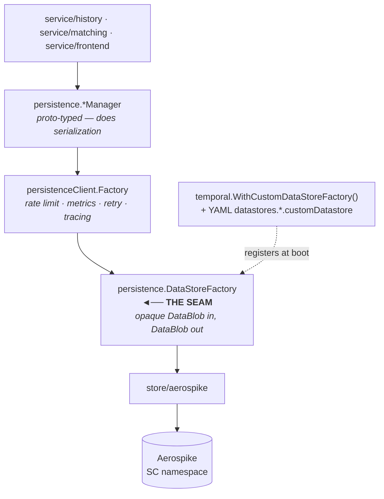

# How Temporal's persistence layer is structured, and where we plug in

Source references are to `go.temporal.io/server` **v1.31.2**, the version pinned in `go.mod`.

## The seam



`persistence.DataStoreFactory` (`common/persistence/persistence_interface.go`) is the entire
contract — nine constructors returning eight store interfaces. Everything below it speaks
`*commonpb.DataBlob`; serialization happens above us. We never parse a workflow proto, only the
fields Temporal has already destructured into its `Internal*` request structs (range IDs, record
versions, run IDs, task keys).

## Registration is out-of-tree, but compiled in

```go
// common/persistence/client/abstract_data_store_factory.go
AbstractDataStoreFactory interface {
    NewFactory(
        cfg config.CustomDatastoreConfig,
        r resolver.ServiceResolver,
        clusterName string,
        logger log.Logger,
        metricsHandler metrics.Handler,
        serializer serialization.Serializer,
    ) persistence.DataStoreFactory
}
```

Wired by `temporal.WithCustomDataStoreFactory()` (`temporal/server_option.go:146`) and selected in
`common/persistence/client/fx.go` by the **presence** of a `customDatastore` key in the datastore
config — not by its `name`. Consequences:

- Exactly **one** custom datastore factory per process.
- There is no plugin registry and no `dlopen`. `sql.RegisterPlugin` exists but is SQL-only. So the
  stock `temporalio/auto-setup` image cannot run this store; we build our own `cmd/` binary.
- The option is marked *experimental* upstream and may change between releases. This is why
  `go.mod` pins an exact version rather than tracking a branch.

## What must be implemented

| Interface | Methods | Needed for "run a workflow with activities"? |
|---|---|---|
| `ShardStore` | 5 | **Yes.** `AssertShardOwnership` may be a no-op — Cassandra's returns nil. |
| `ExecutionStore` | 20 | **Yes**, ~14 of them. Folds in history-events and history-tasks; there is no separate `HistoryStore` interface. |
| `TaskStore` | 13 | **Yes**, first 8. `ListTaskQueue` may return `Unavailable` — Cassandra's does. |
| `MetadataStore` | 8 | **Yes**, ~5. Rename/delete are stubbable. |
| `ClusterMetadataStore` | 7 | **Yes** — read at boot, before any service starts. |
| `QueueV2` | 5 | Constructed eagerly; only exercised on DLQ paths. |
| `Queue` (v1) | 12 | Constructed eagerly as the namespace replication queue. Near-trivial for a single cluster. |
| `NexusEndpointStore` | 4 | Constructed eagerly; the frontend long-polls `ListNexusEndpoints`, which **must return an empty list without erroring**. |

Stubbable at PoC scope: `ListConcreteExecutions`, `GetAllHistoryTreeBranches`,
`DeleteHistoryNodes`, and the five replication-DLQ methods (single-cluster never calls them).

**Visibility is a different seam** — `visibility.VisibilityStoreFactory`, wired by
`temporal.WithCustomVisibilityStoreFactory`. Out of scope; we use Elasticsearch.

## The atomicity requirement

This is the part that decides whether any given database can back Temporal. Cassandra's
`executions` table is partitioned on `shard_id` **alone**, so the shard lease row, every mutable
state row, and every queued task row for a shard live in one partition — which is what lets a
single-partition Paxos batch atomically fence on `range_id`, CAS on `db_record_version`, swap the
current-execution pointer, and insert N task rows in one round.

Operations that require multi-row atomicity:

| Operation | What must be atomic together |
|---|---|
| `CreateWorkflowExecution` | execution row (insert-if-absent) + current-execution row + collection cells + N task rows + range-id fence |
| `UpdateWorkflowExecution` | current-execution CAS + execution row CAS on `db_record_version` + sparse collection deltas + buffered events + optional continue-as-new snapshot + N task rows + range-id fence |
| `ConflictResolveWorkflowExecution` | reset snapshot + optional new workflow + optional current-workflow mutation + pointer swap + fence |
| `AddHistoryTasks` | N task rows across up to 6 categories + fence |
| `CreateTasks` (matching) | N task rows + task-queue `range_id` check |
| `UpdateTaskQueueUserData` | user-data version CAS + build-id index rows |
| `CreateNamespace` | namespace row + notification-version counter (Cassandra does this **non-atomically**, with an explicit orphan-cleanup compensation) |

Error types we must reproduce faithfully — these drive Temporal's own retry logic:
`ConditionFailedError`, `WorkflowConditionFailedError{NextEventID, DBRecordVersion}`,
`CurrentWorkflowConditionFailedError{7 fields}`, `ShardOwnershipLostError`,
`ShardAlreadyExistError`.

The last one is the subtle one. Cassandra gets the conflicting row back for free from the LWT's
returned `previous` map. Aerospike does not, so every failure path needs an explicit read-back.

## The range-scan requirement

`GetHistoryTasks` asks for *"tasks for shard N, category C, key in `[min, max)`, in ascending key
order, paginated"*. Two different orderings are in play:

- **Immediate** categories (transfer, visibility, outbound) order by `task_id`.
- **Scheduled** categories (timers) order by `(visibility_ts, task_id)`.

`RangeCompleteHistoryTasks` deletes over the same range in one statement. Matching's `GetTasks`
does the same over `task_id`, and the fair variant over `(pass, task_id)`.

## Testing

`common/persistence/tests` is a **normal package** (not `_test.go`), exporting `NewShardSuite`,
`NewExecutionMutableStateSuite`, `NewExecutionMutableStateTaskSuite`, `NewHistoryEventsSuite`,
`NewTaskQueueSuite`, `NewTaskQueueTaskSuite`, `NewTaskQueueFairTaskSuite`,
`NewTaskQueueUserDataSuite`, plus `RunQueueV2TestSuite` and `RunNexusEndpointTestSuite`. The older
`persistence-tests` package exports `NewTestBaseForCluster(cluster, logger)`, which bypasses the
`StoreType` switch that would otherwise panic on a non-SQL/non-Cassandra store.

Both are importable from an external module, so ~140 conformance tests run against our store with
no fork. Temporal's **functional** suite (`tests/`) is `package tests` inside `_test.go` files and
is *not* importable — that is the one place a fork is unavoidable, and it is deferred to
Iteration 2.

There is no upstream "adding a persistence plugin" checklist; the table above was derived from the
code. There is also **no schema-version hook for custom datastores** —
`verifyPersistenceCompatibleVersion` hardcodes Cassandra and SQL — so our factory performs its own
version check.

## Sources

- [Persistence docs](https://docs.temporal.io/temporal-service/persistence)
- [Configuration reference](https://docs.temporal.io/references/configuration)
- [History shards](https://docs.temporal.io/temporal-service/temporal-server#history-shard)
- [pkg.go.dev: persistence/client](https://pkg.go.dev/go.temporal.io/server/common/persistence/client)
