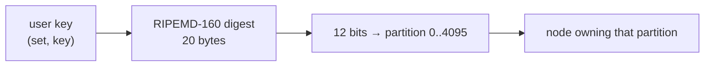

# Aerospike capabilities relevant to Temporal

Every claim here carries a source link. Version floors matter — most of what makes this project
viable arrived in server 8.0.

## Edition and licensing — read this first

| Feature | Edition | Source |
|---|---|---|
| Strong consistency (SC) | **Enterprise only** | [strong-consistency](https://aerospike.com/docs/database/learn/strong-consistency/) |
| Multi-record transactions (MRT) | **Enterprise only** | [FAQ](https://aerospike.com/docs/database/reference/faq/) |
| Durable deletes | **Enterprise only** | [durable-deletes](https://aerospike.com/docs/database/learn/architecture/durable-deletes/) |

The EE container image ships a **perpetual single-node evaluation feature key** (server 6.1+) that
includes `asdb-strong-consistency`, so the PoC needs no key file
([consistency setup](https://aerospike.com/docs/server/operations/configure/consistency)). That key
is governed by Aerospike's evaluation terms.

> **Correction (2026-09-07).** An earlier version of this file quoted the phrase *"not for any
> production use"* and linked it to `aerospike.com/legal/evaluation-license-agreement/`. Both were
> wrong. That URL now serves the **Master Subscription Agreement**, and the quoted phrase does not
> appear in it — it comes from a separate download-trial agreement. The substance (evaluation and
> development only) does hold, but via §1.2 of the actual Evaluation License Agreement, not the
> sentence quoted here.

Two consequences, and the second one is easy to miss:

1. An Aerospike-backed Temporal would only be usable by Enterprise customers, so this bounds who
   the result is for.
2. **The evaluation terms restrict publishing comparative benchmarks.** The Evaluation License
   Agreement §3.1(iv) prohibits "publishing or disclosing to any third party any benchmarking or
   comparative study involving any Product", and the Master Subscription Agreement carries a
   parallel restriction at §7.4(e). This repository *is* a comparative study, and Iteration 2 is
   explicitly about producing performance numbers against a Cassandra baseline — so this constrains
   what may be published, independently of where the demo is hosted.

See [07-hosting-options.md](07-hosting-options.md) for the full licence analysis with verbatim
clauses and current source URLs.

## Strong consistency

- Guarantee is **per-record**; SC "involves no multi-record transaction semantics" on its own.
- Two read modes: **session consistency** (default — monotonic reads/writes, read-your-writes) and
  **linearizable**. Client-side `BasePolicy.ReadModeSC` ∈ `SESSION | LINEARIZE | ALLOW_REPLICA | ALLOW_UNAVAILABLE`.
- `COMMIT_ALL` is **required**; `COMMIT_MASTER` is invalid in an SC namespace.
- Requires a **roster**: an SC namespace serves nothing until the roster is staged and the cluster
  reclustered. This is why `deploy/docker-compose.yml` has a `roster-init` container.
- Cluster size must be ≥ replication factor, so a single node needs `replication-factor 1` —
  explicitly supported.
- Clock skew tolerance ≈ 27s; NTP recommended.

Sources: [learn/strong-consistency](https://aerospike.com/docs/database/learn/strong-consistency/),
[manage/namespace/consistency](https://aerospike.com/docs/database/manage/namespace/consistency),
[policies](https://aerospike.com/docs/server/guide/policies)

## Multi-record transactions (MRT)

Server **8.0.0+**, Go client **v8.0.0+**, **SC namespace required**.
[transactions](https://aerospike.com/docs/database/learn/transactions/) ·
[architecture](https://aerospike.com/docs/database/learn/architecture/transactions)

- **Strict serializability.** Reads are optimistic (versions recorded, re-verified at commit);
  writes take pessimistic locks via a second version in the primary index.
- **Allowed inside:** all single-record ops (`Get`, `Put`, `Operate`, `Add`, `Delete`) **and batch
  commands**.
- **Not allowed inside:** queries and scans — `policy.Txn` is silently ignored for
  `ScanPolicy`/`QueryPolicy`. Also no `info` commands, no `truncate`.
- **Deletes must be durable deletes** (`DurableDelete = true`).
- **Limits:** 4096 distinct writes per transaction (`MRT_TOO_MANY_WRITES`, code 123); unlimited
  reads; single namespace; timeout 0–120s, server default 10s via `mrt-duration`, and the timeout
  clock starts on the first *write*, not the first read.
- **Errors:** 120 `MRT_BLOCKED`, 121 `MRT_VERSION_MISMATCH`, 122 `MRT_EXPIRED`,
  123 `MRT_TOO_MANY_WRITES`.
  [error codes](https://aerospike.com/docs/database/reference/error-codes/)
- **Cost is undocumented.** Mechanically it is ≥3 extra round trips: a monitor-record write, a
  verify batch at commit, and a roll-forward. Measured in Iteration 2.

The commit-time read verification is what makes this useful to us: reading the shard record inside
the transaction and comparing `range_id` gives exactly Cassandra's `IF range_id = ?` fencing.

## Ordering — the decisive constraint

**Secondary indexes do not order results.** *"A secondary index cannot be defined as unique or
sorted… It is up to the application to order query results."*
([of queries and indexes](https://aerospike.com/blog/of-queries-and-indexes/)) Execution is
scatter-gather with no server-side `ORDER BY` or ordered `LIMIT`. `PartitionFilter` paginates in
**digest order**, which is orthogonal to value order. There is also a documented hazard: range
queries can return duplicates if an indexed value increases, or miss records if it decreases,
*within* the query range ([SI architecture](https://aerospike.com/docs/server/architecture/secondary-index)).

**K-ordered map CDTs are the only place the server guarantees order.**
[cdt-map](https://aerospike.com/docs/server/guide/data-types/cdt-map) ·
[cdt-map-ops](https://aerospike.com/docs/server/guide/data-types/cdt-map-ops)

- `get_by_key_range(bin, begin, end)` selects `key >= begin && key < end` — **begin-inclusive,
  end-exclusive**, the same shape as Temporal's `[InclusiveMinTaskKey, ExclusiveMaxTaskKey)`.
- Results return **in native map order** (key-ascending for K-ordered).
- `get_by_index_range` gives an exact "next N in order".
- `PERSIST_INDEX` write flag → O(log N); without it, O(N).
- Map keys may be **integer, string, or blob**.
- **`BYTES` keys compare bytewise** ([CDT ordering](https://aerospike.com/docs/server/guide/data-types/cdt-ordering)).
  This is what lets a big-endian `int64 fireTime ‖ int64 taskID` blob key reproduce Cassandra's
  `(visibility_ts, task_id)` clustering order.

## Size and contention limits

| Limit | Value |
|---|---|
| Max record size (hard) | **8 MiB** incl. metadata |
| `max-record-size` default | **1 MiB** since 7.1, configurable to 8 MiB |
| Maps/lists | bounded by max record size |
| Bins per record | 32,767; bin names ≤ 15 bytes |
| `transaction-pending-limit` | default **20** concurrent ops per key → `KEY_BUSY` (code 14) |

**Every update rewrites the whole record contiguously.** This is the single most important sizing
fact and it does not carry over from B-tree or document stores. An 8 MiB collection record costs
8 MiB of write I/O per single-element append.

Sources: [limitations](https://aerospike.com/docs/database/reference/limitations/) ·
[storage config](https://aerospike.com/docs/database/manage/namespace/storage/config/) ·
[hot key article](https://support.aerospike.com/s/article/Why-does-my-client-return-Error-code-14-Hot-key)

## Sharding — and why it does not line up with Temporal's

Aerospike divides each namespace into **4096 partitions**; the record key is hashed to a
RIPEMD-160 digest and 12 bits of that digest choose the partition.
[data distribution](https://aerospike.com/docs/database/learn/architecture/clustering/data-distribution)

There is **no way to control which partition a key lands in** — no partition-key parameter, no
clustering key. `key.PartitionId()` lets you *observe* it, and `PartitionFilter` lets you target
partitions for scans, but neither gives co-location.

A **record is the unit of placement**, so the only way to co-locate data is to put it in the same
record — bins and CDTs under one key. Using a *set* as a shard is an explicit anti-pattern.

This is the core mismatch with Temporal, which wants everything for a history shard together and
range-scannable. See [03-data-model.md](03-data-model.md) for how we bridge it.

## Go client

`github.com/aerospike/aerospike-client-go/v8` — latest **v8.8.0**.
[docs](https://aerospike.com/docs/develop/client/go/) ·
[transactions](https://aerospike.com/docs/develop/client/go/usage/multi/transactions)

- One client per process; it is thread-safe and holds the connection pools and cluster state.
- `Operate(policy, key, ops...)` — one record lock, ordered atomic bin ops, mixed read/write.
  This is the workhorse; it needs no transaction.
- `Txn` / `client.Commit(txn)` / `client.Abort(txn)`; `NewTxnWithCapacity(reads, writes)`.
  Set `BasePolicy.Txn` on each participating command.
- Generation CAS: `WritePolicy.GenerationPolicy = EXPECT_GEN_EQUAL` + `Generation` from the read.
  On `GENERATION_ERROR` (code 3), retry the **whole** read-recompute-write loop, never just the write.
- `RecordExistsAction`: `CREATE_ONLY`, `UPDATE_ONLY`, `UPDATE` (upsert/merge), `REPLACE`, `REPLACE_ONLY`.
- Known issue to watch: [race in primary-index query pagination](https://github.com/aerospike/aerospike-client-go/issues/438).

## Ops

- Images: `aerospike/aerospike-server-enterprise` (all editions now build from
  [aerospike-server.docker](https://github.com/aerospike/aerospike-server.docker)).
- Ports: 3000 client, 3001 fabric, 3002 heartbeat, 3003 admin (8.1.0+).
- **No bundled healthcheck** ([issue #28](https://github.com/aerospike/aerospike-server.docker/issues/28)).
  `asinfo -v build` proves liveness; `unavailable_partitions=0` proves the SC namespace is usable.
- Roster: `asadm -e "enable; manage roster stage observed ns <ns>"` then `manage recluster`.
- Clients need **direct reachability to every node**; there is no proxy in the data path. In Docker
  this means advertised addresses must be right — see the `alternate-access-address` comment in
  `deploy/aerospike.conf`.
