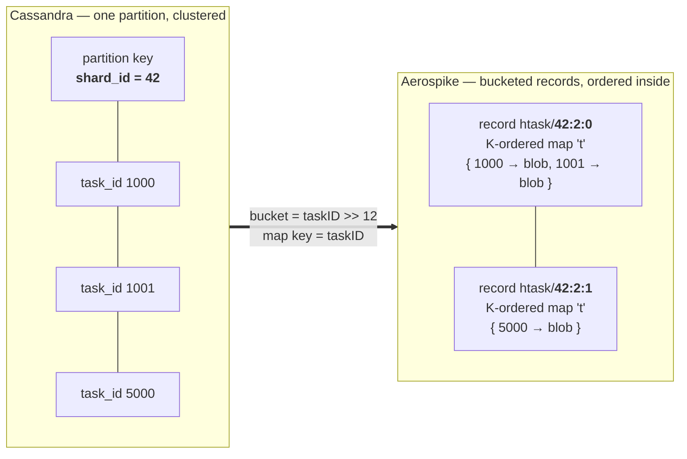
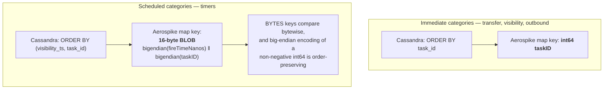
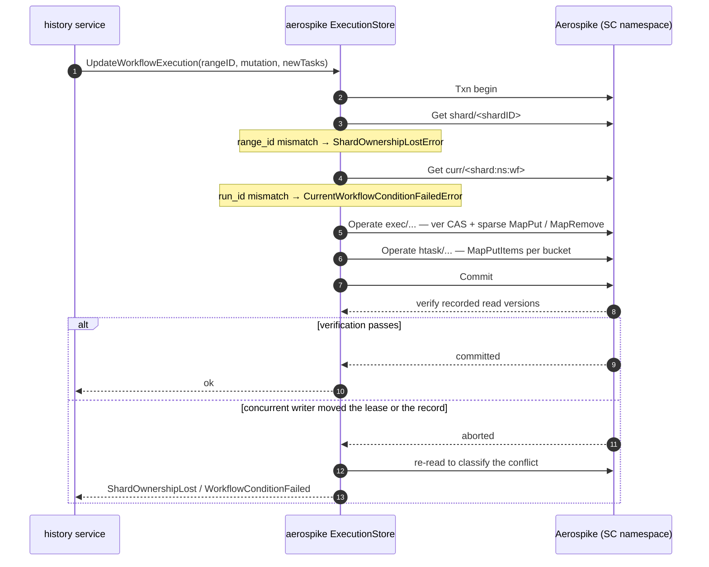
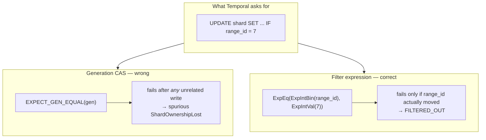
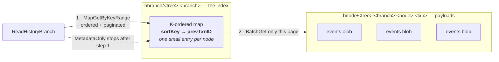

# Data model: Cassandra's shape mapped onto Aerospike's

This is the living document. When the model changes during implementation, it changes here first.

## The problem in one picture

Cassandra gives Temporal three things Aerospike does not have:

| Cassandra | Aerospike equivalent | Consequence |
|---|---|---|
| Partition key we choose (`shard_id`) | none — partition = 12 bits of the key digest | cannot co-locate a shard's records |
| Clustering key with server-side ordering | none across records | no ordered range scan |
| Single-partition conditional (LWT) batch | MRT — but across *any* records | actually **more** general |

So the mapping is: **the clustering key becomes a map key inside a record, and the partition
becomes a bucketed set of records.**

Bucket index is monotonic in the key, and the server orders within a bucket, so reading buckets in
order yields a globally ordered stream. That is the whole trick.

## Sets

Namespace `temporal`. Aerospike creates sets implicitly on first write, so there is no DDL.

| Set | Primary key | Bins |
|---|---|---|
| `shard` | `<shardID>` | `range_id` int, `info` blob, `enc` |
| `exec` | `<shardID>:<nsID>:<wfID>:<runID>` | `info`, `state`, `next_id`, `ver`, `csum`; K-ordered maps `act` `tmr` `chld` `cncl` `sig` `chasm`; lists `sigreq` `buf` |
| `curr` | `<shardID>:<nsID>:<wfID>` | `run_id`, `state`, `status`, `lwv`, `start_time`, `req_ids` |
| `htask` | `<shardID>:<categoryID>:<bucket>` | K-ordered map `t` |
| `hnode` | `<treeID>:<branchID>:<nodeID>:<txnID>` | `events` blob, `enc` |
| `hbranch` | `<treeID>:<branchID>` | `info` blob + K-ordered map `idx`: `nodeID → txnID` |
| `htree` | `<treeID>` | K-ordered map `branchID → branch info` |
| `tq` | `<nsID>:<name>:<type>` | `range_id`, `info`, `user_data`, `ud_version` |
| `task` | `<nsID>:<name>:<type>:<bucket>` | K-ordered map `t`: `taskID → task blob` |
| `ns` | `<nsID>` and `name:<name>` | namespace record and name→id pointer |
| `nsmeta` | `metadata` | `notification_version` |
| `clustermeta`, `membership`, `queue`, `queuev2`, `nexus`, `schema` | — | direct translations |

## Map key encoding

Two orderings exist in Temporal's task model, and both must be exact.

## Bucketing

Bucketing does two jobs at once, and both are load-bearing:

1. **Size.** Every Aerospike update rewrites the whole record. An unbucketed shard queue would
   become a multi-megabyte record rewritten on every enqueue.
2. **Contention.** `transaction-pending-limit` (default 20) means a single "shard 42 task queue"
   record would be the hottest key in the system and would start returning `KEY_BUSY`.

| Category kind | Bucket function |
|---|---|
| Immediate | `bucket = taskID >> 12` (4096 tasks per bucket) |
| Scheduled | `bucket = fireTime` truncated to 1 minute |

Both are first guesses, to be tuned against measurement in Iteration 3 — see
[04-open-questions.md](04-open-questions.md).

**Range read** `[min, max)` → compute the covering bucket span, then per bucket issue
`MapGetByKeyRangeOp`, in bucket order, stopping once the page is full.
**Range delete** → `MapRemoveByKeyRangeOp` per bucket, then durable-delete emptied buckets.
**Pagination token** → our own encoding of `(bucket, lastKey)`. Temporal treats the token as
opaque, so we define the format.

## Atomicity: `UpdateWorkflowExecution`

The call that decides whether the approach works. In Cassandra it is one Paxos batch carrying five
conditions. Here it is one MRT whose commit-time read verification supplies the same fencing.

Two rules fall out of this:

- **Reads must be point or batch reads.** Queries and scans silently ignore `policy.Txn`, so any
  read participating in the transaction has to address known keys. This is another reason the
  bucketed-CDT model wins over a secondary index: bucket keys are computable, index results are not.
- **Sparse deltas, never read-modify-write.** `UpsertActivityInfos` / `DeleteActivityInfos` arrive
  as sparse maps; the store never sees the full collection. They apply as `MapPutItemsOp` /
  `MapRemoveByKeyOp` within a single `Operate`.

## Conditional writes: filter expressions, not generation CAS

Temporal's protocol is full of *value* conditions -- `IF range_id = ?`,
`IF db_record_version = ?`, `IF current_run_id = ?`. The obvious Aerospike analogue is generation
CAS (`EXPECT_GEN_EQUAL`), and it is the wrong tool.

Generation increments on **every** write to a record. Temporal calls `UpdateShard` repeatedly with
an unchanged `rangeID` -- to persist queue ack levels, for instance -- so a caller holding a
`rangeID` it correctly believes current would still be rejected after any unrelated update. That
is a false `ShardOwnershipLostError`, which would make the history service drop and reacquire
shards for no reason.

The right primitive is `WritePolicy.FilterExpression`: a server-side predicate over the record's
bins, evaluated before the write applies. A rejected write returns `FILTERED_OUT` (code 27).

Generation CAS still has a place -- for genuine read-modify-write where the whole record is the
unit of concurrency -- but every condition in this store that mirrors a Cassandra `IF col = value`
uses a filter expression.

## History events: index record + payload records

Task queues pack into bucketed CDT maps because tasks are small. History nodes are not -- a node
carries a batch of workflow events and can be megabytes -- so packing them the same way would risk
the 8 MiB record ceiling and rewrite the whole bucket on every append. Ordering and payload are
therefore separated.

`sortKey` is 16 bytes: `bigendian(nodeID) || bigendian(MaxInt64 - txnID)`. Cassandra clusters
`node_id ASC, txn_id DESC` because "for the same eventID, the node with the larger TransactionID
always wins", and the reader depends on seeing that one first — storing the complement of the txn
id reproduces the descending half under bytewise comparison.

Both records are written in the **same transaction**, so an index entry can never exist without its
payload. Cassandra appends history nodes *before* its mutable-state batch, as separate
unconditional writes, so a failed batch orphans them; folding them into one transaction removes
that failure mode.

## Aerospike client behaviours that will bite you

Four of these cost real debugging time during Phase 2. They are recorded here because none is
obvious from the API, and each fails *silently* rather than loudly.

| Behaviour | Consequence |
|---|---|
| `RecordExistsAction=REPLACE` is incompatible with CDT map operations | `PARAMETER_ERROR`. "Make the record exactly this" has to be expressed as: clear each collection bin, then repopulate, under normal UPDATE semantics. |
| An ordered map reads back as `[]as.MapPair`, an unordered one as `map[any]any` | Asserting only `map[any]any` yields an **empty collection, not an error**. |
| A BLOB map key is `[]byte` via `MapReturnType.KEY` but a fixed-size `[16]uint8` **array** inside a `MapPair` via `KEY_VALUE` | `v.([]byte)` silently fails on the array form. Normalise with `asBytes`. |
| Writing an empty map or empty list | `PARAMETER_ERROR`. Omit the operation, or clear the bin by writing `nil`. |

There is also no `context.Context` anywhere in the client's command API: deadlines are policy
timeouts only, and a context cancelled mid-command cannot interrupt it.

## Error mapping

| Aerospike condition | Temporal error |
|---|---|
| `CREATE_ONLY` write on existing shard record | `ShardAlreadyExistError` |
| `FILTERED_OUT` on the `range_id` condition, or MRT abort on the shard record | `ShardOwnershipLostError` |
| `FILTERED_OUT` on the `ver` (db record version) condition | `WorkflowConditionFailedError{NextEventID, DBRecordVersion}` |
| `curr` run-id / state mismatch | `CurrentWorkflowConditionFailedError` (7 fields) |
| task-queue `range_id` mismatch | `ConditionFailedError` |
| `KEY_BUSY` (14), `MRT_BLOCKED` (120) | retryable — surface as `Unavailable` |
| `MRT_EXPIRED` (122) | `TimeoutError` |

Aerospike does not hand back the conflicting record the way a Cassandra LWT does, so each failure
path performs an explicit read-back to populate these. `CurrentWorkflowConditionFailedError` needs
seven fields, so that read-back is not optional.

## Client policy defaults

| Policy | Value | Why |
|---|---|---|
| `CommitLevel` | `COMMIT_ALL` | mandatory in an SC namespace |
| `ReadModeSC` | `SESSION`, `LINEARIZE` for shard-ownership reads | task-queue reads must not lose tasks |
| `MaxRetries` | `0` on conditional writes | a blind retry of a non-idempotent write is a correctness bug |
| `DurableDelete` | `true` for every delete inside an MRT | required by the transaction contract |
| `RecordExistsAction` | matched per call site | `CREATE_ONLY` for insert-if-absent, `REPLACE` for full overwrite |
