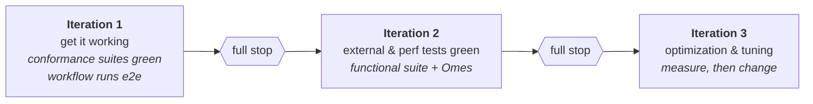

# Iterations 2 and 3 — direction, not commitment

Iteration 1 ends at a full stop. This file records where the work would go next so the direction is
legible; nothing here is planned in detail and the PoC may well stop before it.



## Iteration 2 — external and performance tests

**Functional suite.** `tests/` is `package tests` inside `_test.go` files, so it cannot be imported
from this module. This is where a fork finally becomes necessary: a second, pinned checkout of
`temporalio/temporal` carrying a minimal patch series in `deploy/patches/` —

- an `aerospike` case in `tests/testcore/flag.go` (`-persistenceDriver=aerospike`)
- a matching case in `common/persistence/persistence-tests/setup.go`
- a blank import of this module's store

Start with the smoke set Temporal's own CI uses as its "does this backend work at all" signal:

```
-run 'TestActivityTestSuite|TestSignalWorkflowTestSuite|TestWorkflowTestSuite'
```

then widen. Expect the methods stubbed in Iteration 1 (`ListConcreteExecutions`, the replication
DLQ paths) to start being exercised.

**Performance.** There is no persistence benchmark in the Temporal tree — the in-repo `fairsim` is
a dispatch simulator, not a database benchmark. The realistic path is to stand up the compose stack
(or Temporal's `TestPassivePathServer` long-lived harness) and point
[temporalio/omes](https://github.com/temporalio/omes) `throughput_stress` at it.

Only a **relative** number is meaningful: run the identical scenario against Cassandra on the same
host and report the ratio. An absolute ops/sec figure from a single-node evaluation cluster would
be misleading.

**Where the surprises will come from:** MRT round-trip cost (Q4), bucket sizing (Q2), and `KEY_BUSY`
under concurrency — all unmeasured today.

## Iteration 3 — optimization and tuning

Measurement first; every item below is conditional on Iteration 2 data.

- **Bucket sizing** (Q2) — tune from observed record sizes and `err_rw_pending_limit`.
- **Drop MRTs where a single record suffices.** Every transaction avoided is ~3 round trips saved.
  Any call whose whole write set lands on one record can use plain `Operate`, which is atomic
  within a record and needs neither a transaction nor, in principle, an SC namespace.
- **Batch inside the transaction.** Batch commands are permitted inside an MRT; the hot
  `UpdateWorkflowExecution` path currently issues sequential ops.
- **`PERSIST_INDEX`** on the K-ordered maps — O(log N) instead of O(N) lookups, at a storage cost.
- **Aerospike-side knobs:** `flush-size`, zstd compression, `post-write-cache`, `read-page-cache`,
  `transaction-pending-limit`.
- **Revisit the stubs** — `ListConcreteExecutions` and `GetAllHistoryTreeBranches` need
  non-key-scoped scans, the one access pattern with no good Aerospike answer. Worth deciding
  whether the scavenger is in scope at all.
- **Schema tooling** — whether a `temporal-aerospike-tool` implementing `tools/common/schema.DB`
  is worth building, given that Aerospike has no DDL and sets are implicit.

## The question the PoC actually has to answer

Not "does it work" — Iteration 1 answers that. The real questions are:

1. Does the bucketed-CDT model hold up under concurrency, or does hot-keying dominate?
2. Is the MRT overhead acceptable relative to Cassandra's single-partition LWT batch?
3. Does the Enterprise-only licensing (see [02](02-aerospike-capabilities.md)) leave a viable
   audience for the result?

**A constraint on question 2 that was not visible when this was written:** the evaluation terms
prohibit publishing benchmarking or comparative studies (Evaluation License §3.1(iv), and Master
Subscription Agreement §7.4(e)). Iteration 2 exists to produce exactly such numbers. Measuring
privately to inform a decision is one thing; publishing a Cassandra-versus-Aerospike comparison is
another, and that needs settling with Aerospike before the work is done rather than after. See
[02-aerospike-capabilities.md](02-aerospike-capabilities.md).

Question 3 needs no code and can be answered at any time.
