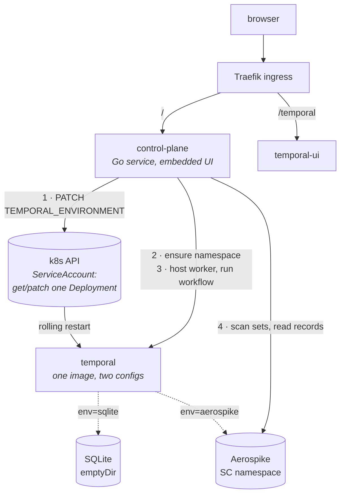
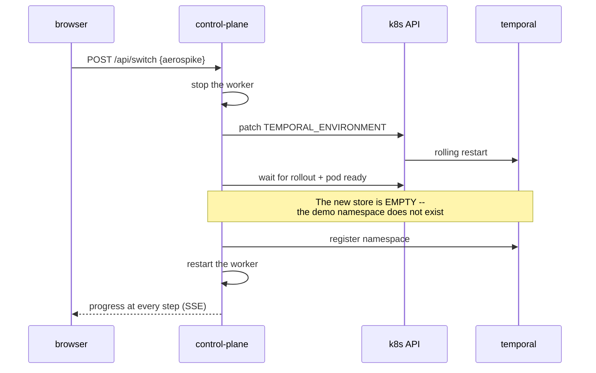

# The demo control plane

A hosted, clickable demonstration of the thing this project set out to prove: that Temporal's
operational persistence can be moved onto Aerospike, and that a workflow does not care which store
is underneath it.

The narrative it exists to support, in order:

1. Temporal is running on **SQLite** — its own built-in dev store.
2. Run a workflow with an activity. It completes.
3. Switch the persistence backend to **Aerospike**.
4. Run the same workflow again. It completes identically.
5. Browse the data now sitting in Aerospike and see Temporal's model in it.

## Shape



## Why the switch is cheap

Two facts, both verified rather than assumed, collapse what looked like the hard part:

**One binary already serves both stores.** `cmd/temporal-aerospike-server` links the SQLite plugin
*and* registers the Aerospike factory, and Temporal's `DataStoreFactoryProvider` dispatches on the
**shape of the config** — `SQL != nil` versus `CustomDataStoreConfig != nil` — not on a build flag.

**The selection is an environment variable.** A single ConfigMap holds `sqlite.yaml` and
`aerospike.yaml`; the container picks one with `TEMPORAL_ENVIRONMENT`, which the binary already
reads. So switching is a patch of one env var on one Deployment, and Kubernetes performs the
rolling restart itself. No ConfigMap surgery, no orchestrated stop/start, no second image.

**SQLite needs no infrastructure at all.** It self-provisions its schema when the connect attribute
`setup` is `"true"`, so the baseline store is a file on an `emptyDir` — no container, no init job.

## The switch sequence

Naive versions of this are broken in a way that only shows up after the first switch:



Skip the namespace registration and "Run workflow" fails immediately after every switch, with an
error that points nowhere useful.

## The first run after a switch is sometimes slow, and we do not know why

Measured on the deployed box: the first workflow after a switch to Aerospike intermittently stalls
for tens of seconds — 31.6 s, 43.1 s, 52.2 s, 53.1 s, 58.6 s, and once past 60 s — against ~50 ms
steady state.

`runSwitch` runs a throwaway workflow before reporting the switch complete, which moves the wait
into the progress log where it is expected rather than leaving it behind a button that should feel
instant. **That is a bandage, not a fix.** The switch costs ~69 s when the stall occurs and ~15 s
when it does not.

An earlier version of this file attributed the stall to "a task queue that matching has just had to
create while a poller was already long-polling it", and a subsequent investigation attributed it to
a four-partition task queue served by a single poller. **Both explanations are wrong**, or at least
insufficient: pinning the queue to one partition was applied, confirmed in effect, and the stall
still reproduced at 31.6 s. See Q7 in [04-open-questions.md](04-open-questions.md) for what is
actually known.

## Deliberate scope## Deliberate scope

- **No data migration.** Switching stores means the previous store's workflows are simply not there.
  That is the honest behaviour, and saying so is part of the demo.
- **No Elasticsearch.** Visibility runs on SQLite in both modes, one file per backend. This isolates
  the variable being demonstrated — only the operational store changes — and takes the box from
  ~6 GB to ~2.5 GB. `deploy/docker-compose.yml` still shows the Elasticsearch pairing for the
  production-shaped setup.
- **`sendKey` is on.** The store normally never stores the user key (see R9 in
  [04-open-questions.md](04-open-questions.md)), so a record browser could only show digests. The
  demo enables it so records read as `3:<namespace-id>:<workflow-id>:<run-id>`. It remains off by
  default, and no store code reads the key back.

## Components

| Piece | Lives in | Does |
|---|---|---|
| Control plane | `cmd/control-plane`, `control/` | Orchestration, Temporal worker, Aerospike browser, HTTP + SSE |
| Web UI | `control/web/` | Plain HTML/JS/CSS, no build step, embedded via `go:embed` |

The UI shows the `htask` set alone, decomposed into shard → category → bucket, rather than a flat
list of every set. That set is where the interesting part of the data model lives: the record key is
`<shard>:<category>:<bucket>`, buckets are ordered so a range read walks them in sequence, and the
server returns entries within a bucket in key order. Immediate and scheduled categories use
different key encodings and are rendered differently, because they *are* different.

**The workflow reports which store it ran on.** The greeting used to be a constant reading
"from Aerospike" regardless of backend, so a SQLite run claimed to be an Aerospike one and the demo
proved nothing. The activity now asks the server (`GetClusterInfo` — note there is no
`DescribeCluster` RPC; `persistence_store` lives on that response) once per execution rather than
caching at worker startup, since the store changes underneath a long-lived worker.

**Reset** wipes Aerospike and returns to SQLite. Order matters: the switch happens *first*, then the
wipe. Truncating while Aerospike is still the active backend would leave a live server holding shard
leases in a store whose contents had vanished.
| Manifests | `deploy/k8s/` | k3s: Aerospike StatefulSet, Temporal, UI, control plane, RBAC, ingress |
| Install guide | `deploy/k8s/README.md` | Fresh box to running demo |

The control plane's Kubernetes permissions are deliberately minimal: `get`/`patch` on one
Deployment and `get`/`list` on Pods, in one namespace. Choosing k3s over Docker Compose was
primarily about this — the Compose equivalent would have meant mounting the Docker socket into an
internet-facing web app, which is root on the host.

## Running it

Locally, against the Compose stack:

```sh
docker compose -f deploy/docker-compose.yml up -d
temporal operator namespace create --namespace demo --retention 24h

TEMPORAL_ADDRESS=127.0.0.1:7233 AEROSPIKE_HOST=127.0.0.1:3000 \
AEROSPIKE_NAMESPACE=temporal PORT=8090 go run ./cmd/control-plane
```

Everything works except the switch, which needs Kubernetes. The UI also runs standalone against
canned data with `?mock=1` — see `control/web/mock/`.

On a box: [deploy/k8s/README.md](../deploy/k8s/README.md), which documents the Civo deployment
including k3s install, native image builds, both credentials, and TLS via cert-manager.

Deployed behind basic auth on a hostname of your choosing — the manifests carry
`temporal-meets-aerospike.example.com` as a placeholder — with a Let's Encrypt certificate and an
HTTP-to-HTTPS redirect ahead of the auth middleware, so credentials are never requested over
plaintext.
